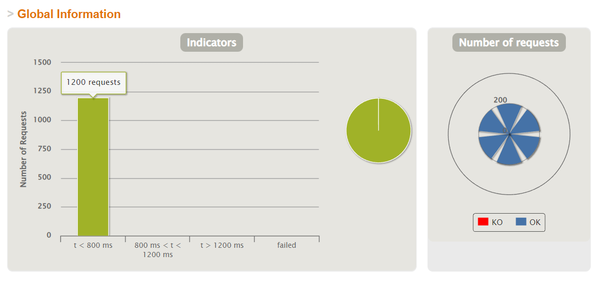
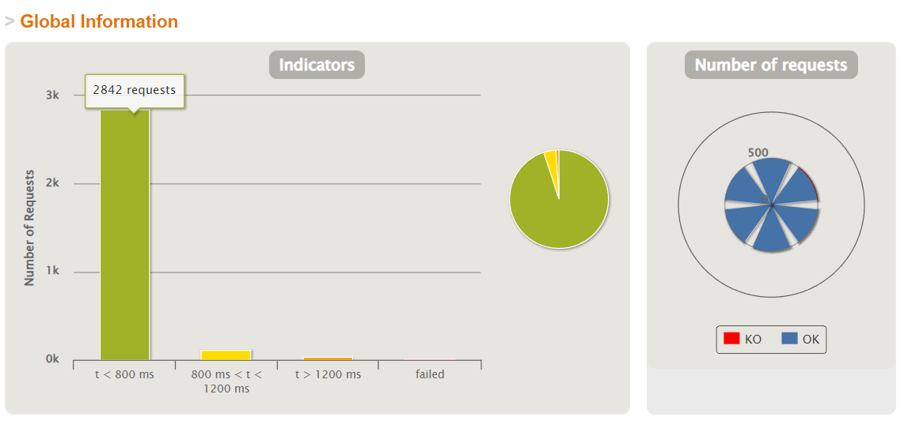
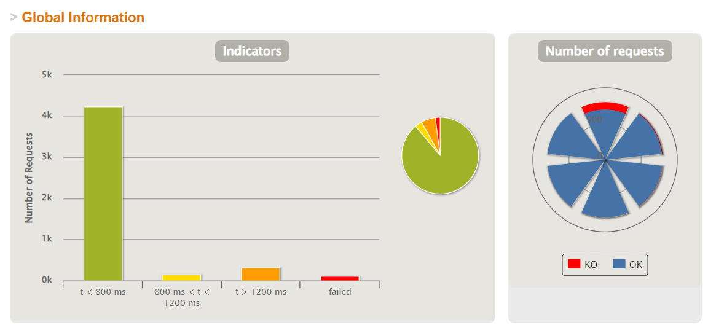
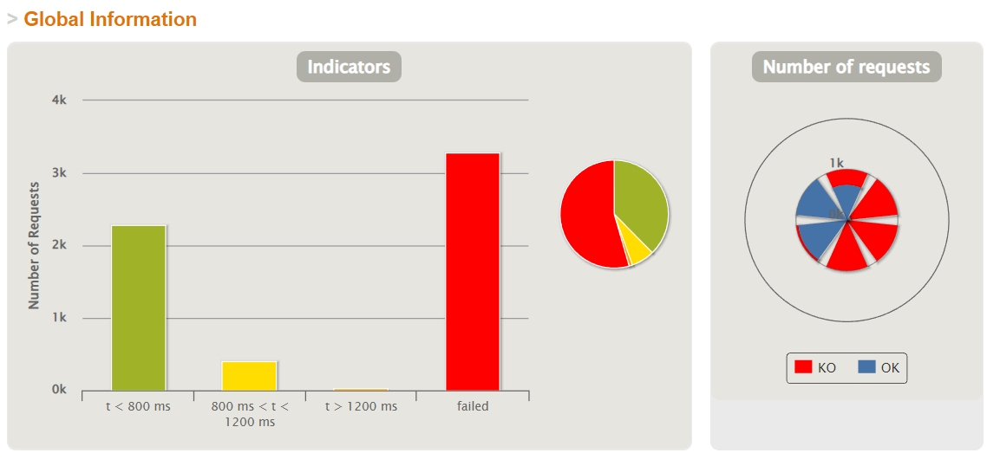

# aw10-final


Please develop a **fully functional** online purchase order system.

- It should have a superb collection of goods merchandises
- Customer can browse/search for merchandises, add selected one into his shopping cart and checkout to complete a transaction.
- User can get delivery status updates continuously.

The system should be of a **reactive architecture**, which means it should be 

-  Responsive: it should response to the user request timely.
-  Resilient: it should not be easily broken down.
-  Elastic: it should be flexible to scale out.
-  Message Driven: it should has loosely coupled components that communicates with each other asynchronously.


Please design tests/experiements to demostrate that your system fulfills such requirements as stated in [The Reactive Manifesto](https://www.reactivemanifesto.org)

**Submit your codes/documents/tests/experiements of your system.**

## 功能模块说明

### pos-discovery
端口号：8761

功能：注册中心，使用eureka为每个微服务提供节点
### pos-gateway
端口号：80

功能：作为网关，将发送至网关的请求转发至每个微服务节点
### pos-products
端口号：0(随机端口)

功能：商品管理模块，为系统提供商品相关的服务接口

相关api：
```yaml
/api/products
  get: 查看所有商品信息
/api/products/{productId}
  get: 根据id查询某一特定商品信息	
```
### pos-counter
端口号：0(随机端口)

功能：进行账单结算，创建账单
```yaml
/api/bill:
  post:创建账单
```
### pos-carts
端口号：0(随机端口)

功能：购物车模块，商品可加入购物车中，为系统提供购物车相关的服务接口

相关api：
```yaml
/api/item
  get: 看购物车中所有商品
  delete: 删除
/api/item/{productId}
  post: 购物车中添加商品
  put: 更新item商品的数量
/api/item/toOrder:
  post: 将购物车商品转换为订单
```

### pos-order
端口号：0(随机端口)

功能：订单模块，购物车结账即产生订单，为系统提供订单相关的服务接口

相关api:
```yaml
/api/order
  post: 产生一个订单
/api/order/{id}
  get: 根据id获取订单信息
/api/order:
  post: 创建订单
```

### pos-delivery
端口: 0(随机端口)

功能: 物流信息相关的功能模块

相关api:
```yaml
/api/delivery
  post: 产生一个订单
/api/delivery/{delivery-id}
  get: 获取订单信息
```

## 实验
### 实验设备
cpu i7 12700

内存 32g

操作系统 Win10

JDK JDK11

### 实验内容
我设置了四组实验，分别模拟200,500,800,1000个用户同时访问。
访问内容如下
1. /api/products,获取商品列表
2. /api/item/{id},添加商品1到购物车
3. /api/item/{id},添加商品2到购物车
4. /api/item/convertOrder,结账
5. /api//delivery,查看订单的物流信息

### 实验结果
#### 200

### 500

### 800

### 1000


### 实验结果分析
通过对上面四组实验室的对比然后结合之前aw04的实验结果，我们可以得出将响应式引入可以提高服务器的性能和吞吐量，已经cpu利用率。
在实验电脑上，我们可以注意到当200，500时系统可以较好的承受压力.所有都能完成，且在1200以下。但是平均延迟仍有所增加。但是当用户量达到800时，
出现fail的情况，且平均时延进一步增加。到1000时，则出现大规模的失败情况，排队论中的理论。
具体实验结果见gatling目录下的。